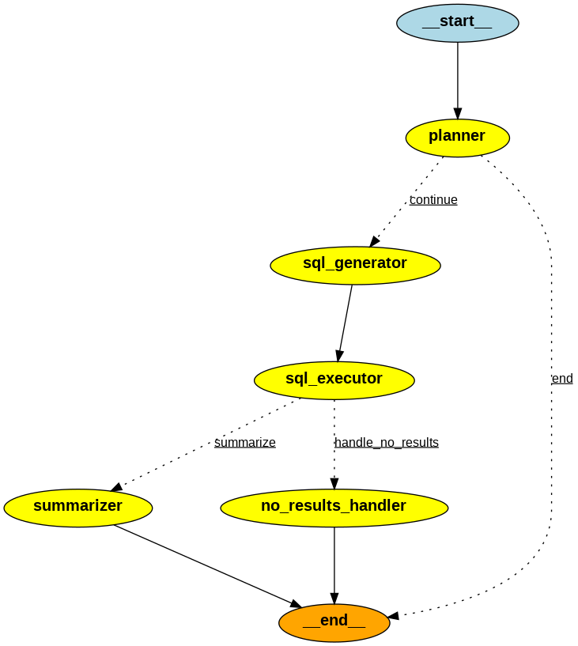

# 🚗 AI Car Buying Assistant

A Streamlit‑based AI agent that helps users find the perfect car from a dealership’s inventory. It leverages Google’s Gemini model and the LangGraph framework to deliver a conversational, chat‑based experience—from your initial query to detailed vehicle recommendations.

---

## 🔍 Features

* **Conversational AI**
  Chat with an expert automotive consultant powered by Gemini.

* **Synchronized Filters**
  Sidebar controls (price, make, condition, body style, etc.) that the AI understands and applies to its search.

* **Database Integration**
  Generates and executes SQL queries against a local SQLite database of vehicle inventory.

* **Detailed Summaries**
  Rich, formatted overviews of top matches—including pricing, offers, and clickable links.

* **Smart Error Handling**
  If no vehicles match your criteria, suggests ways to broaden or refine your search.

* **Secure**
  All API keys are managed via environment variables and never committed to source control.

---

## 🎲 Data Source

Inventory data is populated through a combination of web scraping and synthetic augmentation.
Original data was scraped from:
[https://www.californiacaronline.com](https://www.californiacaronline.com)


NOTE : There could be some discrepency with the vehicle link and the actual data present there since they are a combintaion of synthetic data generation and basic webscraping

---

## 🛠️ Setup & Installation

1. **Clone the repository**

   ```bash
   git clone <your-repo-url>
   cd Automotive_retail_agent
   ```

2. **Create and activate a virtual environment**

   ```bash
   # macOS / Linux
   python3 -m venv venv
   source venv/bin/activate

   # Windows
   python -m venv venv
   .\venv\Scripts\activate
   ```

3. **Install dependencies**

   ```bash
   pip install -r requirements.txt
   ```

4. **Populate the database**

   ```bash
   python setup_database.py
   ```

   This will scrape (and/or load synthetic) data and create `car_inventory.db`.

5. **Configure environment variables**

    Add your GOOGLE_API_KEY in nodes.py file
      ```ini
      GOOGLE_API_KEY="AIzaSy...your...key"
      ```


6. **Run the Streamlit app**

   ```bash
   streamlit run app.py
   ```

   Open your browser to `http://localhost:8501` to interact with the assistant.

---

## ⚙️ Architecture & Workflow

The assistant is implemented as a LangGraph state machine:

1. **Planner**
   Determines whether to ask clarifying questions or proceed with a search.

2. **SQL Generator**
   Constructs a precise SQLite query based on user input and active filters.

3. **SQL Executor**
   Executes the query against `car_inventory.db`.

4. **Decider**

   * **Summarizer (Results Found):** Builds a detailed summary of matching vehicles.
   * **No Results Handler (No Matches):** Suggests adjustments to your search criteria.

---

## 📈 Conversation Workflow



---
